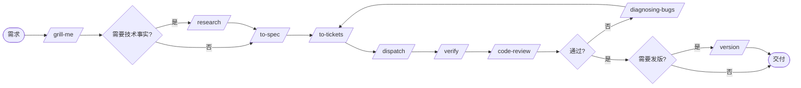

# 我的开发研究工作流 Skills

参考 [mattpocock/skills](https://github.com/mattpocock/skills) 的结构。这套工作流只有两个变量：**任务内容** 和 **谁来执行**。

## 三条基本约定

**执行方式只有一种：git worktree。** 每个 ticket 一个独立工作树、一个分支。不区分任务系统、队列或面板，任何 ticket 都走同一条路。

**只有一份注册表：`.workflow/agents.json`。** 它同时列出本机和服务器上有哪些 agent，每个 agent 只记录 harness、模型强弱、响应速度快慢、所在机器和擅长领域。没有 runtime 或 adapter 注册表。

**本机和服务器能力相同。** 两台机器都能规划、调研、执行、review 和验证。差别只有一个：各自装了哪些 agent。所以没有任何阶段被绑定在某台机器上。

## 工作流



`/dispatch` 的内部顺序：排阻塞边 → 建 worktree → 按当前机器选 agent → 给工具建议 → 完成后合并。

## agent 推荐怎么用

每个 ticket 带两条推荐，独立判断：

```yaml
phase: execution
local: codex-gpt
server: oh-my-pi-gpt
```

`/route-agent` 先给 ticket 定档位，再判断这一侧谁适合。关键和复杂档**优先交给 `strength: high`**；本侧没有 high 就用最强者顶上并在理由里注明降级，不写 `manual` 把 ticket 挂起来。

用判断，不用计分：说清「为什么它适合这件事」，而不是数 tags 命中数。`speed` 只在机械档位和同档位内部起作用。

`/dispatch` 只看当前在哪台机器上跑，取对应那一条。值写 `manual` 表示由当前会话或人工完成。

## Skills 目录结构

```
skills/
  ask/             # 根技能：场景路由器
  planning/        # 规划、调研、spec、ticket、版本
    grill-me/
    research/
    to-spec/
    to-tickets/
    version/
  dispatch/        # 推荐、分派、验证
    route-agent/
    dispatch/
    verify/
  engineering/     # 工程实践
    readable-docs/
    tdd/
    diagnosing-bugs/
    code-review/
    context-sync/
  setup/           # 初始化
    setup-workflow/
    setup-agents/
      agents.baseline.json   # 基线名单，跨项目复用
```

每个 skill 文件夹内含一个 `SKILL.md`，使用 YAML frontmatter 声明 `name`、`description` 和可选的 `disable-model-invocation`。

没有 `integrate` skill。合并是 `/dispatch` 流程的自然结尾。

本仓库没有 `.workflow/`。它是 skill 集合，`.workflow/` 属于每个使用这套 skill 的项目。

## 安装

把 `skills/` 目录放入各机器自己的 skill 目录，或按该机器的方式建立 symlink。本机和服务器装同一份，不要各自维护副本。

## 在一个新项目里启用

以下步骤都在**那个项目**里跑，不在本仓库里：

1. `/setup-workflow` 创建该项目的 `.workflow/`、路径类 `config.json`，并把 `.worktrees/` 加进 `.gitignore`
2. `/setup-agents` 把 `agents.baseline.json` 复制成该项目的 `.workflow/agents.json`，再按两台机器的实际情况增改
3. `/context-sync` 检查两台机器的文档和 skills 是否一致
4. 不知道从哪里开始时运行 `/ask`

## 约定

- `.workflow/` 在**被管理的项目**里，必须提交到那个项目的 git
- `.worktrees/` 是被管理项目的工作目录，必须进它的 `.gitignore`
- ticket 必须自包含，route 块给出 `local` 和 `server` 两条推荐
- agent id 用稳定的 kebab-case，引用时只写 id，不写 display_name
- 材料不足时不写结论，文档遵守 `/readable-docs`
- 不改写本仓库里 skills 的结构去适配某个具体项目
- 不使用 em-dash
