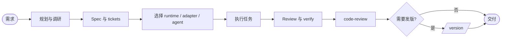

# 我的开发研究工作流 Skills

参考 [mattpocock/skills](https://github.com/mattpocock/skills) 的结构。这套工作流把任务内容、Agent 和运行环境分开建模，让本机、CodeG 或其它 runtime 都可以承担规划、执行、验证和 review。

## Runtime 架构

| 维度 | 真相源 | 例子 |
|------|--------|------|
| Runtime | `.workflow/runtimes.json` | 本机工作区、CodeG 工作区、其它托管环境 |
| Adapter | runtime 下的 adapter | 本机会话、CodeG To-dos、脚本任务队列 |
| Agent | `.workflow/agents.json` | 任意数量、任意名称和角色的 agent |
| 路径 | `.workflow/config.json` | tickets、specs、research、handoffs 等目录 |

本机和 CodeG 是平等的可选运行环境，不分别承担固定的规划端或执行端职责。一个 ticket 可以显式指定 `runtime_id`、`adapter_id` 和 `agent_id`，也可以让路由器按能力动态选择。

## Agent 与 Runtime 的分离

Agent 注册表只保存稳定的 agent ID、显示名、可选角色、标签、成本档和描述。Runtime 注册表保存 adapter、能力、可用 agent policy 和阶段默认路由。

不使用单一 `manual_entry`。如果 planning、execution、verification 或 review 需要不同默认目标，在 `.workflow/runtimes.json` 的 `routing.defaults` 中分别设置。没有唯一候选时向用户提问。

## CodeG runtime 与 adapter 能力

如果项目注册了 CodeG runtime，可以使用它的 `codeg-todos` adapter 提供的能力：

- To-dos 任务队列
- 每个任务独立 git worktree
- 并发限制和自动处理
- Review、Follow up、Merge、Complete、Abandon
- `@` 委托
- preflight command

这些能力只在 adapter 声明后可用。移除 CodeG runtime 不会删除工作流，本机或其它 runtime adapter 仍可按自身能力运行任务。

## 主工作流：idea → ship



这张图只展示阶段关系。每个阶段的具体 runtime 由 registry、ticket route 和本次调用共同决定。规划、执行、验证和 review 可以在同一 runtime，也可以在不同 runtime。`.workflow/` 通过 git 共享 spec、ticket、research、handoff 和验证报告。

## Skills 目录结构

```
skills/
  ask/             # 根技能：场景路由器
  planning/        # 规划、调研、spec、ticket、版本
    grill-me/
    research/
    to-spec/
    to-tickets/
    version/
  dispatch/        # 路由、分派、验证、集成
    dispatch/
    route-agent/
    integrate/
    verify/
  engineering/     # 工程实践
    readable-docs/  # .workflow 文档写法规范
    tdd/
    diagnosing-bugs/
    code-review/
    context-sync/
  setup/            # 初始化和注册表
    setup-workflow/
    setup-agents/
    setup-runtimes/
```

每个 skill 文件夹内含一个 `SKILL.md`，使用 YAML frontmatter 声明 `name`、`description` 和可选的 `disable-model-invocation`。

## 安装

### 任意本地 runtime

将 `skills/` 目录放入该 runtime 的 skill 目录，或按该 runtime 的方式建立 symlink。确保规划、执行、验证和 review 所需的 skill 都可读取。

### CodeG runtime

CodeG 可以把本仓库的 skill 放入它的共享 skill 存储，例如 `~/.codeg/skills/`，再按当前 `runtimes.json` 中的 adapter 能力和 agent policy 启用。不要假设所有 skill 只给某个固定 agent，也不要把 planning 或 dispatch 限制给固定入口。

## 首次配置

1. 运行 `/setup-workflow` 创建 `.workflow/` 和路径类 `config.json`
2. 运行 `/setup-agents` 创建或维护 `.workflow/agents.json`
3. 运行 `/setup-runtimes` 创建或维护 `.workflow/runtimes.json`
4. 运行 `/context-sync` 检查各 runtime 的文档和 skill 是否一致
5. 不知道从哪里开始时运行 `/ask`

## 约定

- `.workflow/` 是共享上下文载体，必须提交到 git
- ticket 必须自包含，并保留 canonical route：`phase`、`runtime_id`、`adapter_id`、`agent_id`、`capabilities_all`、`capabilities_any`
- Agent ID 使用稳定的 kebab-case，显示名可变
- 材料不足时不写结论，文档遵守 `/readable-docs`
- 不使用 em-dash
