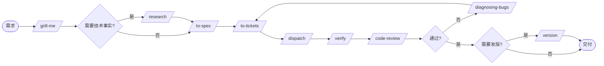

# Ask

你不一定记得每个 skill，所以先问。`/ask` 负责判断下一步。

## 先记住三件事

- **执行方式只有一种**：每个 ticket 一个 git worktree。没有别的机制需要选。
- **只有一份注册表**：`.workflow/agents.json`，记录本机和服务器上有哪些 agent。没有 runtime 或 adapter 注册表。
- **本机和服务器能力相同**，都能规划、调研、执行、review 和验证。差别只在各自装了哪些 agent。

所以路由只需要回答一个问题：这个 ticket 交给谁最合适。每个 ticket 有两条推荐，`local` 一条、`server` 一条，执行时按当前所在机器取一条。

`/route-agent` 先给 ticket 定档位，再判断谁适合。关键和复杂档（认证、迁移、并发、跨模块重构、性能定位、疑难 bug）**优先交给 `strength: high`**；本侧没有 high 就用最强者顶上，并在理由里注明降级。这是判断，不是数 tags 计分。

## 主流程：规划 → 调研 → 执行 → review → 修 bug



### 各步做什么

1. **`/grill-me`**：通过 relentless interview 把模糊想法磨成可写 spec 的输入
2. **`/research`**：需要技术事实时派后台调研，结果写入 `.workflow/research/`。事实是 agent 的活，不要拿去问用户
3. **`/to-spec`**：综合对话、grill 摘要和调研，产出 `.workflow/specs/` 下的 spec
4. **`/to-tickets`**：拆成自包含 ticket，声明阻塞边和本机/服务器两条 agent 推荐
5. **`/route-agent`**：推荐有疑问时预检，补齐 `manual` 或缺的推荐
6. **`/dispatch`**：排执行顺序、建 worktree、选定 agent、给工具建议，完成后合并
7. **`/verify`**：合并后做全量验证，产出验证报告
8. **`/code-review`**：双轴审查，规范符合 + 工程标准
9. **修 bug**：`/diagnosing-bugs` 建反馈循环、定位根因、写 post-mortem
10. **`/version`**：验证通过后处理 release

## 入口支线

### A. 项目初始化

以下都在**被管理的项目**里跑，不在 skills 仓库里：

- **首次启用**：`/setup-workflow`，在该项目创建 `.workflow/` 和路径类 `config.json`，并把 `.worktrees/` 加进该项目的 `.gitignore`
- **登记 agent**：`/setup-agents`，把基线名单 `agents.baseline.json` 复制成该项目的 `.workflow/agents.json`，按本机和服务器各有哪些 agent、harness、模型强弱、速度、擅长领域增改
- **同步多台机器**：`/context-sync`，检查该项目的 `.workflow/` 和 skills 是否一致

### B. 想法到代码

- 模糊想法：`/grill-me`
- 需要事实调研：`/research`，完成后回到 grill 或进入 spec
- 已经清楚：`/to-spec` → `/to-tickets` → `/route-agent` → `/dispatch`

### C. Bug 修复

1. `/diagnosing-bugs` 建立红色反馈循环、定位根因
2. `/to-tickets` 写入 `.workflow/bugs/tickets/`
3. `/dispatch` 执行修复
4. `/verify` 跑回归
5. 重大修复或 BREAKING 时运行 `/version`

不要在没有红测试的情况下直接打补丁。

### D. 紧急修复

1. 跳过 grill，先 `/diagnosing-bugs`
2. 写 `hotfix-<date>-<seq>` ticket
3. **先定档位**。线上事故大多是关键档，优先给本侧 `strength: high` 的 agent；本侧没有 high 就用最强者顶上并注明降级。纯改动性的小修复才是机械档，那时才优先 `speed`
4. 修复后立即 `/verify`，必要时 `/version` 切 patch

### E. 换机器继续

1. 确认 `.workflow/` 已 commit 并推送
2. 另一台机器拉取同一个 commit
3. 按 ticket 的 route 块取这台机器那一侧的推荐
4. 继续 `/dispatch`、`/verify` 或 `/code-review`，不需要重新解释上下文

## 工程纪律

- **`/readable-docs`**：写 research、spec、ticket、handoff、verify 报告和 ADR 时使用
- **`/tdd`**：实现非文档 ticket 时遵守
- **`/diagnosing-bugs`**：测试失败、flake、regression 或线上事故时使用
- **`/code-review`**：实现完成、合并完成或发布前使用
- **`/context-sync`**：多台机器之间文档或 skills 不一致时使用

## 快速决策树

### 场景 1：有一个模糊想法

```text
/grill-me
├─ 需要技术事实 ─→ /research ─→ 回 grill
└─ 已清楚 ─→ /to-spec ─→ /to-tickets
   └─ 推荐不确定 ─→ /route-agent ─→ /dispatch
```

### 场景 2：有 ticket 待分派

```text
/route-agent
├─ 两条推荐都有值 ─→ /dispatch
└─ 有 manual 或失效 id ─→ 补齐注册表后重算

/dispatch
├─ 排批次 ─→ 第 1 批可并行，批次间串行
├─ 建 worktree ─→ 一个 ticket 一个
└─ 按当前机器取 local 或 server 推荐
```

### 场景 3：任务完成，准备交付

```text
合并 worktree（dispatch 流程结尾）
  └─→ /verify
      ├─ 通过 ─→ /code-review ─→ 可选 /version ─→ ship
      └─ 失败 ─→ 写 bug fix ticket ─→ /dispatch
```

### 场景 4：想改 agent 清单

```text
/setup-agents
├─ 改 display_name / description ─→ 不影响任何 ticket
├─ 改 tags ─→ 影响后续推荐
├─ 改 strength ─→ 改变它能优先接的档位，重新 /route-agent
├─ 改 speed ─→ 只影响机械档位和同档位内部
├─ 改 host ─→ 两台机器的推荐都会变
└─ 改 id ─→ 必须迁移所有 ticket 里的 local: 和 server: 引用
```

## 反模式

- 🚫 重新引入 runtime、adapter 或任务系统这些维度
- 🚫 把本机写成规划端、服务器写成执行端
- 🚫 认为某台机器不能做某个阶段
- 🚫 ticket 只写一条推荐
- 🚫 多个 ticket 共用一个 worktree
- 🚫 跳过 `/to-tickets` 直接分派复杂需求
- 🚫 跳过 review 直接 ship
- 🚫 没有红测试就修 bug
- 🚫 跨机器只同步代码，不同步 `.workflow/`

## 输出模板

```markdown
## 你现在的场景：<场景名>

### 你在哪
<一句话说明当前机器、工作区状态和 .workflow 状态>

### 下一步
<一个具体 skill 名称和一行提示>

### 路由
- Phase：<phase>
- 本机：<agent-id 或 manual>
- 服务器：<agent-id 或 manual>

### 注意
<该场景特有的限制或下一步>
```

## 详细规则 cross-reference

| 想知道什么 | 看哪 |
|-----------|------|
| agents.json 的字段和登记流程 | `setup/setup-agents/SKILL.md` |
| `.workflow/` 目录和路径配置 | `setup/setup-workflow/SKILL.md` |
| 路由的档位与适合性判断 | `dispatch/route-agent/SKILL.md` |
| ticket 模板和 route 块 | `planning/to-tickets/SKILL.md` |
| 执行顺序、worktree、工具建议、合并 | `dispatch/dispatch/SKILL.md` |
| 验证清单和报告 | `dispatch/verify/SKILL.md` |
| 双轴代码复审 | `engineering/code-review/SKILL.md` |
| 多机器同步 | `engineering/context-sync/SKILL.md` |
| 文档写法和 Mermaid 规则 | `engineering/readable-docs/SKILL.md` |

## 独立 skills

- `/setup-workflow`：目录和路径初始化
- `/setup-agents`：agent 清单
- `/route-agent`：推荐预检
- `/version`：release 管理
