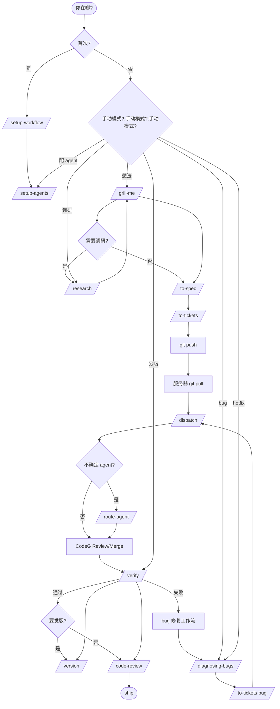

# Ask

你不一定记得每个 skill，所以先问。

一个 **flow** 是一条贯穿多个 skill 的路径。大多数工作沿一条 **主流程** 走，两条 **入口支线** 汇入它。其余是独立的，或跑在底下的词汇层。

## 主流程：idea → ship

大多数工作走这条路。你有一个想法，想让它变成代码。

1. **`/grill-me`** 通过 relentless interview 打磨想法。**从这里开始**：你在本机 VS Code 里，有一个模糊需求或想法，需要把它问清楚。多轮提问，每轮推进 frontier，直到想法足够清晰可以写 spec。

2. **分叉：需要技术调研吗？**
   - **需要** → **`/research`** 派后台 agent 查文档、读源码、验证 API。拿到结果后回到 grill 继续。
   - **不需要** → 直接进下一步。

3. **`/to-spec`** 把 grill 摘要综合成正式 spec。不重新 interview，只做综合。产出 `.workflow/specs/<feature>.md`。

4. **`/to-tickets`** 把 spec 拆成 tracer-bullet ticket。每个 ticket 自包含，声明阻塞边，标注建议 agent。产出 `.workflow/tickets/` 下的一组文件。

5. **交接到服务器**：git push，然后在服务器 CodeG 上 git pull。

6. **`/dispatch`** 在 CodeG 的 To-dos 面板中创建任务，选对应 agent。两种模式：
   - **独立 To-do**：每个 ticket 一个任务，各自在独立 worktree 中运行（适合互不依赖的 ticket）
   - **`@` 委托**：在一个会话中用 `@agent` 让主 agent 委托子任务给其它 agent（适合主从型多 agent 协作）
   不确定哪个 agent？先跑 **`/route-agent`** 预检。

7. **CodeG Review / Merge**：任务完成后在 To-dos 的 Review 列看 diff，点 Merge。CodeG 的 agent 在自己的 session 中执行合并，自动解决冲突，CodeG 用 git 验证。**大多数情况你不需要 `/integrate`**。

8. **`/verify`** 全量验证（类型检查、lint、测试、构建）。也可以在 CodeG 的 Task settings 里设 preflight command，让每个任务进 review 时自动验证。

9. **本机复审**：git pull，然后 **`/code-review`** 做双轴审查（规范符合 + 工程标准），作为交付前最终检查。

### 上下文卫生

步骤 1-4 尽量在**一个不间断的 context window** 里完成（不要 compact 或 clear，直到 `/to-tickets` 之后），让 grill、spec、ticket 建立在同一个思考上。每个 ticket 在服务器端各自独立执行，互不干扰。

### 主入口：manual_entry agent

主流程上 1-4 步（grill-me / research / to-spec / to-tickets）和 8 步（verify）都跑在同一个 agent 会话里——`.workflow/agents.json` 里 `manual_entry: true` 的那个 agent。这是"手动会话默认入口"。

- 默认配置下通常是 Pi
- 想换主入口（比如把 Pi 换成 Claude Code）→ 跑 `/setup-agents` 把别的 agent 的 `manual_entry` 改 `false`、把新 agent 的 `manual_entry` 改 `true`
- 服务器端 ticket 执行的 agent 不受这条规则影响，那是按 `/route-agent` 动态派的

主流程 step 5 的 git push 和 step 6-9 的服务器端操作（dispatch / review / merge / verify / code-review）允许跨多个会话，因为它们涉及文件 I/O 和服务器端状态，不依赖主流程的 context 连续性。

## 入口支线

一个起始场景，产生工作后汇入主流程。

### A. 项目初始化

- **首次在项目上启用本工作流** → **`/setup-workflow`**。只创建 `.workflow/` 目录与最小 `config.json`；CodeG 端的 Task settings、Skill 矩阵、agent 安装由用户在 CodeG 里自己配。每个项目运行一次。
- **想加 / 删 / 改 agent** → **`/setup-agents`**。改 `.workflow/agents.json`，跑一次；`/route-agent` / `/dispatch` / `/verify` 自动按新表路由。
- **配置没生效或怀疑环境出问题** → 跑 **`/context-sync`** 检查本机 ↔ CodeG 同步状态。

### B. 想法 → 代码

- **本机有个模糊想法** → **`/grill-me`** 起步，**主流程 step 1**。
- **需要技术调研才能决定方向** → **`/research`** 派后台 agent 查 primary source。结果回来后决定是继续 grill 还是直接 spec。

### C. bug 修复

分两条路径：开发中发现 vs 外部报告，**不要混淆**。

- **服务器上 agent 跑出的代码有 bug**（CodeG Review 时发现）→ **`/diagnosing-bugs`** 跑一遍，再决定走 fix-ticket 流或回到 dispatch 加 Follow up。
- **开发到一半发现 bug**（自己写的、之前 ticket 合并的、外部报的）→ 走 bug 修复工作流：
  1. **`/diagnosing-bugs`** 跑五阶段（反馈循环 → 定位 → 根因 → 修复 → post-mortem）。复现命令写到 `.workflow/bugs/repros/`、postmortem 写到 `.workflow/bugs/postmortems/`
  2. 写 fix ticket 走 **`/to-tickets`**，写到 `.workflow/bugs/tickets/`（不走 `.workflow/tickets/`，避免污染 feature 批次）
  3. **`/dispatch`** 派 `agents.json` 里 manual_entry 的那个 agent 执行（涉及架构或安全再切到 cost_tier: expensive 的 agent）
  4. **`/verify`** 跑回归
  5. 修完决定要不要切版本（`/version`，重大修复或 BREAKING 时跑；版本归档时按 commit 范围挑出相关 bug fix ticket，在 `archive/v<version>/bug-tickets.md` 写索引；repros / postmortem 在 `archive/v<version>/bug-repros.md` / `bug-postmortems.md` 写索引；并给原 ticket 加 `released: v<version>` 标签）
  不在这一支线上"打补丁直接 commit"——bug 修复必须走 ticket，原因：留下 regression 测试、留下 post-mortem、留下 commit history。

### D. 紧急修复（hotfix）

线上事故或内存泄漏这种 P0 修复，节奏比 feature 短得多：

1. **跳过 grill**——目标是修复，**不是打磨想法**
2. **`/diagnosing-bugs`** 跑五阶段，但**postmortem 写到 `.workflow/bugs/postmortems/hotfix-<date>-<slug>.md`**（标记 hotfix）
3. 写 hotfix ticket 走 **`/to-tickets`**，**强制 ticket id 用 `hotfix-<日期>-<序号>`**（不走普通数字序号）
4. **`/dispatch`** 派 Pi（便宜档够用，避免昂贵档拖延）
5. 合并后**立即 `/version` 切 patch 版本**——hotfix 必须发版，不能等下一批
6. **同步发版后跑 `/verify` 确认线上指标恢复**（这一步不只是编译过）

hotfix ≠ 普通 bug：hotfix 走 patch 版本号、走紧急分支、走立刻发版。详情看 `/version` SKILL 的 pre-release 段。

### E. PR review 与外部反馈

- **收到 GitHub PR review 反馈**（reviewer 留了 comments）→ 复制反馈到 `/diagnosing-bugs` 起一个 fix ticket 走 bug 修复工作流，**不要直接在原 ticket 上 reply**——reviewer 的意见是新产品需求，不是原任务的延续
- **GitHub issue 上的需求** → 视为新想法走主流程 step 1（grill-me），不要直接开 ticket——issue 上的描述通常不够具体
- **CodeG Review 列出现 Follow up** → 走 bug 修复工作流的小循环，不重开 dispatch

## 工程纪律

不是功能开发，是代码质量保障。model-invoked，agent 实现时自动遵守。**每个纪律有明确的"何时该用"判别**——别当它们是冗余的格式化规则：

- **`/readable-docs`** — 写任何 `.workflow/` 下的 Markdown 时遵守
  - **何时用**：写 research / spec / ticket / grill 摘要 / 验证报告 / version 决策记录时
  - **核心**：先对人可读，再对 agent 可解析
  - **判定**：文档写完问一下自己——30 秒后我自己读得懂吗？agent 拿得到它需要的边界信息吗？

- **`/tdd`** — agent 实现 ticket 时遵守
  - **何时用**：任何非纯文档、非纯配置的实现 ticket
  - **核心**：红 → 绿循环，好测试是 seam 上的行为测试
  - **判定**：修复 bug 前有没有先写红测试？没有就别动代码

- **`/diagnosing-bugs`** — 遇到非显然 bug 时遵守
  - **何时用**：测试失败、间歇性 flake、regression、线上事故
  - **核心**：先有反馈循环再修复，五阶段（创建反馈 → 定位 → 根因 → 修复 → post-mortem）
  - **判定**：能找到一个命令现在就跑就红吗？没有就别修

- **`/code-review`** — 服务器结果拉回本机后跑
  - **何时用**：git pull 完，准备合 main 之前
  - **核心**：双轴审查（规范符合 + 工程标准）
  - **判定**：合并 commit 进 main 前最后一次复审；CI 跑过 ≠ 这次 review 可以省

- **`/context-sync`** — 本机 ↔ CodeG 同步规范
  - **何时用**：skills 在两端对不上、`.workflow/` 内容不一致、agent 找不到某个 skill 时
  - **核心**：两端共享 `.workflow/`，skills 同步到 `~/.codeg/skills/`
  - **判定**：怀疑有不对的认知或环境漂移时跑一次，不要等出错

## 服务器端执行

服务器端跑的 skill，都从 `.workflow/agents.json` 读 agent 列表，**不硬编码**：

- **`/route-agent`** 是路由大脑：根据 ticket 内容 + agents.json 的 tags + cost_tier 自动决定派哪个 agent
  - 不确定怎么分派 → 跑 `/route-agent` 预检
  - ticket 写了 `## 建议 Agent` → 直接用 ticket 的；没写 → 跑 route-agent 判
- **`/dispatch`** 是入口：在 CodeG To-dos 面板创建任务，分派 agent（由 route-agent 决定）
  - 两种模式：独立 To-do（互不依赖的 ticket）/ `@` 委托（主从协作）
- **`/integrate`** 是补充：CodeG 的 Merge 流程已处理单任务级别冲突解决，本 skill 只在跨 ticket 问题时用
- **`/verify`** 是收尾：全量验证。也可用 CodeG 的 preflight command 自动化
  - 默认跑在 `agents.json` 里 `manual_entry: true` 的那个 agent 会话里

服务器端的 agent 矩阵（哪些 skill 启用给哪些 agent）由 `engineering/context-sync` 协同维护。

## 全流程总览

````markdown

````

图里出现的 skill 都可以反向追踪到下文决策树。

## 独立

不在主流程上、但随时可以单独调用的 skill。

- **`/setup-workflow`**：首次配置。每个项目运行一次。**只管路径类配置**（`.workflow/config.json`）。
- **`/setup-agents`**：管理 `.workflow/agents.json` 的 agent 注册表。新增 / 删除 / 改 agent 的 `id` / `display_name` / `cost_tier` / `tags` / `manual_entry`。**改 agent 配置只动这一个文件**。
- **`/route-agent`**：独立运行可预检所有 ticket 的 agent 分派。也可被 `/dispatch` 调用。基于 agents.json 的 tags + cost_tier 动态路由。
- **`/version`**：release 节点调用，跑在 `/verify` 通过之后。生成 CHANGELOG、bump 版本号、打 git tag、归档当前批次到 `archive/v<version>/`、追加 `history.md`。

## 快速决策树

按"你现在在哪个场景"对号入座。每个分支都给出**该场景的所有必要步骤**，不是只给第一站。

### 场景 1：我在本机 VS Code，脑子有个想法

```
想法够清晰吗？
├─ 不够 ─→ /grill-me
│   └─ 中途需要查文档? ─→ /research ─→ 回 grill
├─ 需要调研 ─→ /research ─→ 回 grill
└─ 够了 ─→ /to-spec ─→ /to-tickets ─→ git push
   └─ 标 ticket 时不确定派哪个 agent? ─→ /route-agent 预检
```

### 场景 2：服务器 CodeG 上有 ticket 待分派

```
/dispatch（在 To-dos 面板创建任务）
├─ 不知道选哪个 agent ─→ /route-agent
└─ 任务完成 ─→ CodeG Review 列
   ├─ Merge ─→ /verify
   ├─ Follow up ─→ bug 修复工作流
   └─ Complete / Abandon ─→ 下一个 ticket
/verify 通过
├─ 要发版 ─→ /version
└─ 不发版 ─→ git pull ─→ /code-review ─→ ship
```

### 场景 3：本机拉回了服务器代码，准备交付前复审

```
git pull
├─ 怀疑 agents.json / skills 不同步 ─→ /context-sync
└─ /code-review（双轴：规范符合 + 工程标准）
   ├─ 没问题 ─→ ship
   └─ 有问题 ─→ bug 修复工作流
```

### 场景 4：遇到 bug（开发中 / Review 时发现 / 外部报告）

```
┌─ 是 P0 线上事故吗? ─→ 走 hotfix 流（D 入口支线）, 见下方
└─ 不是, 常规 bug
   /diagnosing-bugs（5 阶段）
   ├─ 小改 ─→ bug fix ticket ─→ /to-tickets ─→ /dispatch
   ├─ 大改 ─→ 先 /to-spec, 再 /to-tickets, 再 /dispatch
   /verify（回归）
   ├─ 重大修复或 BREAKING ─→ /version
   └─ 不是 ─→ ship
```

### 场景 5：hotfix（线上事故）

```
/diagnosing-bugs（5 阶段，但 postmortem 加 hotfix 标签）
hotfix ticket（id 用 hotfix-<date>-<seq>，不走普通编号）
/dispatch（派便宜档 agent，避免拖延）
立即 /version 切 patch 版本
/verify 确认线上指标恢复
```

### 场景 6：要发版 / 切版本

```
前提：/verify 已通过
/version
├─ 工具自动生成 CHANGELOG ─→ 检查一遍措辞
├─ 检查版本号（package.json / pyproject / ...）是否漏改
├─ 打 annotated tag
└─ /verify 再确认
   ├─ OK ─→ 推到 npm / PyPI / Docker Hub
   └─ 失败 ─→ 回到 bug 修复工作流
   归档自动完成：specs + feature tickets 移到 archive/v<version>/
   bug fix ticket 写索引到 archive/v<version>/bug-tickets.md
   bug 复现与 postmortem 写索引到 archive/v<version>/bug-repros.md / bug-postmortems.md
   history.md 追加一段
```

### 场景 7：想加 / 删 / 改 agent

```
/setup-agents
├─ 加 ─→ 填 id / display_name / cost_tier / tags / manual_entry
├─ 删 ─→ 先 grep ticket 看死引用
└─ 改 ─→ display_name 安全，cost_tier / manual_entry 要慎重，id 改走迁移
跑完 /route-agent 自动按新表路由
```

### 场景 8：收到外部反馈（GitHub issue / PR review / 同事提需求）

```
是 issue 提的需求? ─→ 视为新想法 ─→ 场景 1
是 PR review 反馈? ─→ 复制到 /diagnosing-bugs ─→ 场景 4
是 CodeG Follow up? ─→ 场景 4
是同事随便提的"这个能不能改"? ─→ /grill-me 判断要不要做
```

### 场景 9：研究陷入死胡同

```
/research 跑了但查不到 ─→ 换关键词再跑一次
还查不到 ─→ 上 grill 把"待查 X"加进问题的 frontier, 等下次
完全无法决策 ─→ 找人问 ─→ 不要硬猜
```

### 场景 0：不知道从哪开始

```
看上面的"全流程总览" Mermaid 图
├─ 看到了 ─→ 回到场景 1-9
└─ 还是看不到 ─→ 直接把上一份 README.md 的目录贴过来, 选看起来相关的
```

## 反模式

🚫 **用 `/ask` 当搜索引擎**：ask 是路由器不是百科。想了解某个 skill 怎么用，去读那个 SKILL.md
🚫 **跳过 grill 直接写 spec**：grill 是把模糊需求磨到能写的成本最低方式。跳过 grill 写的 spec 通常要返工
🚫 **跳过 `/to-tickets` 直接 `/dispatch`**：dispatch 需要 ticket 文件做 payload。手动分派也行但失去了 tracer-bullet 拆分的好处
🚫 **跳过 `/diagnosing-bugs` 直接打补丁修 bug**：没有红测试的修复叫猜测不叫调试，下一次同样的 bug 会再来
🚫 **打完 `/dispatch` 不看 Review 列**：CodeG 的 review 是给你看 diff 的机会，不看等于失去了质量门
🚫 **跳过 `/code-review` 直接 ship**：CI 跑过 ≠ 工程标准 OK；本机复审是最后一道防线
🚫 **用 `/ask` 问"我应该怎么想"**：ask 不替你思考。grill 是用来逼你想清楚的，ask 只告诉你路径
🚫 **频繁切换 manual_entry agent**：manual_entry 一改，所有手路径默认入口都跟着换。短期切换会让上下文浪费
🚫 **grill / spec / tickets 跨 context window**：step 1-4 在一个不间断的 context 里完成是这条规则的灵魂，分割就断了思考链

## 输出模板

ask 收到的回复，按 `/readable-docs` 的工整回复规则，给用户三条：当前所在场景 / 下一步具体动作 / 注意事项。

````markdown
## 你现在的场景：<场景名>

### 你在哪
<一行说清当前处境，例如 "本机有模糊想法，git 仓库里 .workflow/ 已建好">

### 下一步
<一个具体 skill 名字 + 一行提示>

### 注意
<这个场景特有的提醒，例如 hotfix 跳过 grill、bug 修复必须写 ticket>

### 不确定走哪条?
看 `skills/ask/SKILL.md` 的"快速决策树"，按你的处境对号入座。
````

## 详细规则 cross-reference

每个 skill 的完整规则在各自的 SKILL.md 里，ask 只给"用谁、什么时候用"，不给"怎么用"：

| 想知道什么 | 看哪 |
|-----------|------|
| grill 怎么问 / 什么时候结束 | `planning/grill-me/SKILL.md` |
| research 怎么派 / 输出格式 | `planning/research/SKILL.md` |
| spec 模板 / 章节怎么写 | `planning/to-spec/SKILL.md` |
| ticket 模板 / 拓扑图怎么画 | `planning/to-tickets/SKILL.md` |
| 路由算法 / 关键词表 / cost_tier 兜底 | `dispatch/route-agent/SKILL.md` |
| dispatch 两种模式 / 状态标记 | `dispatch/dispatch/SKILL.md` |
| integrate 跨 ticket 协调场景 | `dispatch/integrate/SKILL.md` |
| verify 命令清单 / preflight | `dispatch/verify/SKILL.md` |
| 版本 bump 规则 / 工具选型 | `planning/version/SKILL.md` |
| bug 5 阶段 / 产物落点 | `engineering/diagnosing-bugs/SKILL.md` |
| agents.json schema / 增删 agent | `setup/setup-agents/SKILL.md` |
| 路径类配置 / config.json 字段 | `setup/setup-workflow/SKILL.md` |
| 工程纪律怎么用 / 反模式 | `engineering/{tdd,readable-docs,code-review,context-sync}/SKILL.md` |
| 文档怎么写 / 段落切分 / emoji | `engineering/readable-docs/SKILL.md` |