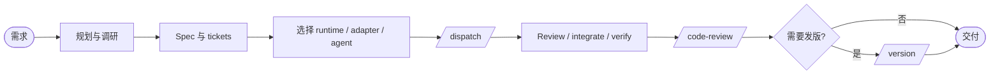

# Ask

你不一定记得每个 skill，所以先问。`/ask` 负责判断下一步，不替用户隐藏 runtime、adapter 或 agent 选择。

## 三个维度先分清

- **Runtime**：任务在哪里运行，例如本机工作区、CodeG 工作区或其它已注册环境
- **Adapter**：通过什么机制运行，例如本机会话、CodeG To-dos 或脚本任务队列
- **Agent**：谁执行，来自 `.workflow/agents.json`

`.workflow/runtimes.json` 管 runtime、adapter、能力、agent policy 和阶段默认路由。`.workflow/agents.json` 管 agent ID、显示名、角色、标签和成本。没有唯一候选时询问用户，不默认本机、CodeG 或某个 agent。

## 主流程：idea → ship

1. **选择交互目标**：当前会话或 `/route-agent` 选择具备 `interactive`、`plan` 或 `research` 能力的 runtime、adapter 和 agent。
2. **`/grill-me`**：通过 relentless interview 把模糊想法磨成可写 spec 的输入。
3. **需要技术事实时 `/research`**：使用具备 `research` 的目标调研，结果写入 `.workflow/research/`。需要后台时额外要求 `delegation` 或 `parallel`。
4. **`/to-spec`**：综合对话、grill 摘要和调研，产出 `.workflow/specs/` 下的 spec。
5. **`/to-tickets`**：拆成自包含 ticket，声明阻塞边、phase、所需能力和 canonical route。`runtime_id`、`adapter_id`、`agent_id` 都可以是 `auto`。
6. **`/route-agent` 预检**：传入对应 phase，为缺少 route 的 ticket 输出完整的 runtime + adapter + agent。
7. **`/dispatch`**：在具备 `dispatch` 或 `execute` 的目标上创建任务。只有 adapter 声明了并发、隔离或委托能力，才使用对应功能。
8. **Review 和 integrate**：优先使用目标 adapter 的能力。CodeG To-dos 的 Review/Merge 是 `codeg-todos` 的可选实现。
9. **`/verify`**：使用独立的 `verification` phase，在具备 `verify` 的目标上执行类型检查、lint、测试、构建和集成检查。
10. **`/code-review`**：使用 `review` phase，在任意具备 `review` 能力的 runtime 上做规范符合和工程标准双轴审查。
11. **`/version`**：验证通过后，在具备 `execute` 和 `verify` 能力的目标上处理 release。

### Canonical route

新 ticket 和调用参数使用统一格式：

```yaml
phase: execution
runtime_id: auto
adapter_id: auto
agent_id: auto
capabilities_all: [execute]
capabilities_any: []
```

`agent_id: null` 表示当前用户会话、脚本或人工执行。它只能路由到 `agent_ids: []` 的 agentless adapter。

### 路由优先级

1. 用户本次调用明确指定
2. ticket 的 canonical route
3. `runtimes.json` 当前 phase 的默认值
4. 按能力、状态、agent tags 和 cost_tier 动态匹配
5. 仍不唯一时询问

显式 route 冲突时停止并报告，不静默更换环境或 agent。

### 上下文卫生

grill、research、spec 和 ticket 尽量在一个连续的交互上下文里完成，但不要求它们运行在同一个 runtime。切换 runtime 时，把摘要、决策、研究和 route 写入 `.workflow/` 并通过 git 同步。

## 入口支线

### A. 项目初始化

- **首次启用**：运行 `/setup-workflow`，只创建 `.workflow/` 和路径类 `config.json`。
- **配置 agent**：运行 `/setup-agents`，维护 `.workflow/agents.json`。允许为空。
- **配置 runtime 或 adapter**：运行 `/setup-runtimes`，维护 `.workflow/runtimes.json`。
- **同步状态异常**：运行 `/context-sync`，检查 `.workflow/`、registry 和各 runtime 的 skills。

### B. 想法到代码

- 模糊想法：`/grill-me`
- 需要事实调研：`/research`，完成后回到 grill 或进入 spec
- 已经清楚：`/to-spec` → `/to-tickets` → `/route-agent` → `/dispatch`

### C. Bug 修复

1. `/diagnosing-bugs` 建立红色反馈循环、定位根因并写 post-mortem
2. `/to-tickets` 写入 `.workflow/bugs/tickets/`
3. 为 fix ticket 写 `phase: execution` 的 route，或让 `/route-agent` 按能力和 tags 动态匹配
4. `/dispatch` 执行修复
5. `/verify` 跑回归
6. 重大修复或 BREAKING 时运行 `/version`

不要在没有红测试的情况下直接打补丁。

### D. 紧急修复

1. 跳过 grill，先 `/diagnosing-bugs`
2. 写 `hotfix-<date>-<seq>` ticket
3. 选择具备 `execute` 的最快可用 route，成本档只是约束，不是固定 agent
4. 修复后立即 `/verify`，必要时 `/version` 切 patch

### E. PR review 与外部反馈

- GitHub issue 需求：视为新想法，走 `/grill-me`
- PR review 反馈：作为 bug 或新需求，走 `/diagnosing-bugs` 或 `/grill-me`
- 任意 adapter 的 follow up：回到对应 ticket 的修复循环，不假设它一定是 CodeG Follow up

## 工程纪律

- **`/readable-docs`**：写 research、spec、ticket、handoff、verify 报告和 ADR 时使用
- **`/tdd`**：任何 runtime 的 agent 实现非文档 ticket 时遵守
- **`/diagnosing-bugs`**：测试失败、flake、regression 或线上事故时使用
- **`/code-review`**：实现完成、集成完成或发布前使用，不固定在本机
- **`/context-sync`**：runtime 间文档或 skills 不一致时使用

## 全流程总览

````markdown

````

这张图只展示阶段关系。`/integrate` 只有目标 adapter 没有足够的 `merge` 能力，或确实需要跨 ticket 协调时才进入；它不是每次 dispatch 后的必经步骤。

## 独立 skills

- `/setup-workflow`：路径和目录初始化
- `/setup-agents`：agent 注册表
- `/setup-runtimes`：runtime、adapter、能力、agent policy 和默认路由
- `/route-agent`：完整路由预检
- `/version`：release 管理

## 快速决策树

### 场景 1：有一个模糊想法

```text
有交互式目标吗？
├─ 没有 ─→ /setup-runtimes，选择具备 interactive 的目标
└─ 有 ─→ /grill-me
   ├─ 需要技术事实 ─→ /research ─→ 回 grill
   └─ 已清楚 ─→ /to-spec ─→ /to-tickets
      └─ route 不确定 ─→ /route-agent ─→ /dispatch
```

### 场景 2：有 ticket 待分派

```text
/route-agent（phase: execution）
├─ 有唯一 runtime / adapter / agent ─→ /dispatch
├─ 有多个候选 ─→ 选择或配置 routing.defaults.execution
└─ 无候选 ─→ 检查 capabilities、agent_ids 和 registry

/dispatch
├─ 目标有 isolated-worktree ─→ 使用隔离任务
├─ 目标有 parallel ─→ 按阻塞边并行
└─ 没有这些能力 ─→ 按拓扑顺序串行，并在输出中说明
```

### 场景 3：任务完成，准备交付

```text
adapter 有 merge? ─→ 先使用 adapter 内置 review / merge
adapter 没有 merge? ─→ 按需 /integrate
然后 ─→ /verify（phase: verification）
├─ 通过 ─→ /code-review（phase: review）─→ 可选 /version ─→ ship
└─ 失败 ─→ bug fix ticket ─→ /dispatch
```

### 场景 4：想改 agent 或 runtime

```text
想改 agent ─→ /setup-agents
├─ 改 display_name / role ─→ 不影响机器引用
├─ 改 tags / cost_tier ─→ 重新 /route-agent 预检
└─ 改 id ─→ 迁移 ticket、handoff 和 adapter 引用

想改 runtime / adapter ─→ /setup-runtimes
├─ 改显示名 ─→ 不影响 route
├─ 改 capabilities ─→ 检查受影响 ticket
└─ 停用 ─→ 先把未完成 ticket 改派或标记 blocked
```

## 反模式

- 🚫 把本机写成规划端、CodeG 写成执行端
- 🚫 只写 agent，不写 runtime 和 adapter
- 🚫 恢复单一 `manual_entry` agent
- 🚫 adapter 没有能力却声称支持并发、worktree、Review 或 Merge
- 🚫 跳过 `/to-tickets` 直接分派复杂需求
- 🚫 跳过 review 直接 ship
- 🚫 没有红测试就修 bug
- 🚫 跨 runtime 只同步代码，不同步 `.workflow/` 文档和 registry

## 输出模板

```markdown
## 你现在的场景：<场景名>

### 你在哪
<一句话说明当前 runtime、adapter、工作区状态和 .workflow 状态>

### 下一步
<一个具体 skill 名称和一行提示>

### 路由
- Phase：<phase>
- Runtime：<id、auto 或待用户选择>
- Adapter：<id、auto 或待用户选择>
- Agent：<id、auto、null 或待用户选择>

### 注意
<该场景特有的限制或下一步>
```

## 详细规则 cross-reference

| 想知道什么 | 看哪 |
|-----------|------|
| runtime、adapter、能力、agent policy 和默认路由 | `setup/setup-runtimes/SKILL.md` |
| agents.json schema、role 和 agent 迁移 | `setup/setup-agents/SKILL.md` |
| 路由算法、phase 和完整输出 | `dispatch/route-agent/SKILL.md` |
| ticket 模板、canonical route 和能力字段 | `planning/to-tickets/SKILL.md` |
| 分派、并发、隔离和 adapter 差异 | `dispatch/dispatch/SKILL.md` |
| 验证 route、命令清单和报告 | `dispatch/verify/SKILL.md` |
| 跨 ticket 集成 | `dispatch/integrate/SKILL.md` |
| 双轴代码复审 | `engineering/code-review/SKILL.md` |
| 多 runtime 同步 | `engineering/context-sync/SKILL.md` |
| 文档写法和 Mermaid 规则 | `engineering/readable-docs/SKILL.md` |
```
