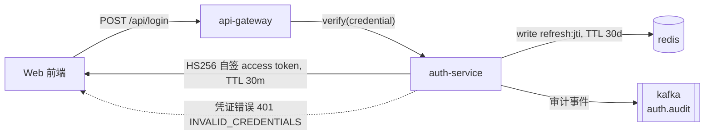

# Readable Docs

`.workflow/` 下的每份文档都有两个读者：你自己，和执行任务的 agent。agent 可以运行在任意 registered runtime。现有模板只服务了后者（自包含、可解析），结果是人读起来费劲。本 skill 补上第一个读者。

## 两个读者要什么

| | 人 | agent |
|:--|:--|:--|
| 需要的 | 顺着读能知道结论、依据、不确定在哪 | 精确定位，不用猜，不用去翻别的文件 |
| 不需要的 | 为了填满模板而写的句子 | 需要人替换的代词、隐喻、含糊指称 |

两者不冲突。冲突时人优先：agent 读不懂的地方可以加字段，人读不懂的地方只能重写。

## 材料门槛

动笔前先数手里的材料。材料指可核验的事实：来源链接、文档章节号、源码文件行号、命令输出、实测数字、用户原话。

- 数不出材料的段落直接删掉，不要为了对齐模板把标题填满
- 没有材料支撑的判断只能进「不确定的部分」，不能进「结论」
- 文档写得短不算问题，灌水才是

**什么算有材料。** 判据是读者能不能自己去核：

- ✅ **能引到具体出处就算。** 官方文档哪一节、源码哪一行、命令输出、实测数字、用户原话
- ✅ **能引到原文的推论也算。** 只要结论背后有具体段落可核，哪怕是你自己推出来的。在结论里写清是推论，并指向那两处原文
- ❌ **引不到出处的纯推理不算。** 只是「听起来合理」「通常都这么干」的，进「不确定的部分」，并写明需要什么材料才能定

## 说话位置

动笔前内部回答三件事，不必原样写给用户：

1. 这条结论是怎么来的（查了什么、跑了什么、谁说的）
2. 哪一条材料改变了最初的判断
3. 到现在哪一块仍然拿不准，拿不准到什么程度

第 3 项必须落在文档里。写「需要进一步调研」等于没写，要写成「未在官方文档中找到对该行为的描述，只在 GitHub issue #123 里有人提及，未本地复现，可以用 `<命令>` 在十分钟内验证」。

## 每段推进一件事

新段落必须给新东西：新事实、新数字、新的反例、新的代价、新的后果。同一个结论换个说法不算推进。

写完一段问自己：删掉它，读者会损失什么信息。答不上来就删。

不要用「更深入一层」「真正的关键在于」「换个角度看」这类路标连接段落。推进靠材料和因果，不靠路标。

## 段要短

大段文字是最容易让人放弃阅读的东西。分段多一点，别怕碎。

- **一段只装一件事。** 讲完就换行，哪怕这一段只有一行
- **三到五行是舒适区。** 超过五行就找拆分点
- **拆分点在这些地方**：判断转到依据、机制转到后果、换了主体、换了时间、举完例子回到论点
- **单句成段可以用。** 留给需要停一下的地方，判断、警告、举例、转折
- **并列的东西写成列表。** 三个以上同类项塞在一段里，读者数不清，拆成列表
- **Markdown 里段与段之间必须空一行。** 紧挨着的两行会被渲染成同一段，空行才算分段

宁可多分几次。读者滚动时看到的应该是一个个小块，不是一大坨。但不要把一个完整的句子从中间切开，分行要落在意思的边界上。

## 中文写法

- **动作写成动词。** 「实现效率的提升」写「快了 40ms」，「进行调研」写「查了」。
- **主语和动作挨着。** 先让人和事出现，再补时间、条件、原因、例子。
- **判断直接下。** 先给结论，紧跟依据，不要先立一个读者没有的误解再推翻。
- **不排整齐的三段式。** 三项以上同构排比，换一种说法或删掉。
- **篇幅服从材料。** 结论三行就三行。

## 用 emoji 帮人跳读

emoji 的职责是让文档能被扫读，不是装饰，更不是情绪表达。你滚动一份 research 时先看到的是「哪一节是结论、哪一条标了风险、哪条还没验证」，emoji 就是在承担这个工作。

**默认多用。** 拿不准该不该加的时候，加。省着用换来的是成片的黑字，那是读者最不想看到的东西。

**本 skill 不提供 emoji 对照表，你自己按内容选。** 固定映射表会让所有文档长得一样，那样反而没人看 emoji 了。

选的原则：

- **同一份文档里自洽。** 概念 X 用了某个 emoji，全篇都用它。不要「结论」用 🎯、「影响」也用 🎯、下一节又换一个意思相近的
- **不同文档可以不同。** 下一份 research 是另一件事，重新选一套更贴合的。不要跨文档追求统一
- **emoji 补充语义，不替代语义。** 可以写 `✅ 三条结论全部在 BCP 原文中找到出处`，不能只写 `✅` 让人猜通过的是什么
- **不要在 emoji 后重复它已经表达的意思。** 「⚠️ 注意风险」是重复的，「⚠️ 凭证错误时返回 401 而不是 200」才是信息

放的位置，能用就用：

- **每个段落的开头**，做视觉锚点。一段一件事，那件事前面配一个 emoji，读者滚过去一眼就知道这段在讲什么
- **列表的每一条前面**，尤其是验收标准、并列结论、步骤清单
- **章节标题**，让目录能当索引扫
- **状态标记**：通过、失败、待验证、有阻塞
- **风险、陷阱、容易踩的坑**
- **表格的状态列**，以及第一列作为条目标记

**不用刻意节省。** emoji 密度高，跳读的粒度就细。一份长文档里出现几十个 emoji 是正常的，只要每个都对应一处实际内容。

唯一的边界是**区分度**，判据是语义而不是次数：

- 👍 **同一个 emoji 承载同一个意思，重复没问题。** 四条并列的「待验证」都挂 ⏳，表格状态列里的 ❌ 表示「不能用」出现五次，都是对的，这叫一致不叫滥用
- 🔀 **同一个 emoji 被拿去表示两种不同的东西，读者就分不清它在标什么**，这时必须换一个
- 🫥 **同一种语义在一屏里铺得太满会失效。** 如果每段开头都是 ✨，那所有段落看起来一样，锚点就没了作用。要检查的是锚点之间能不能互相区分，不是数个数

不放的位置：

- 证据原文、引语、命令输出、代码块里，那里是证据本身的地盘
- 行文中间把 emoji 插在数字和单位之间，会打断读数
- 正文句子的中间，会打断句子

段落开头的锚点紧跟着数字、节号或单位是正常的，不算「插在读数里」。例如 `📐 §10.2.3 用的是小写 ought to wait` 这样开段是对的，规则针对的是行文中途横插一个符号。

## Mermaid 图

架构图的价值不在画全，在于让读者一次看到关系。一屏看不懂的图等于没画。

**一张图回答一个问题。** 画之前先写出这个问题。写不出来的，说明还没想清楚要表达什么，先别画。常见的问题类型：模块之间谁依赖谁、一次请求经过哪些环节、状态怎么迁移、哪些 ticket 卡住哪些。

**节点用真实名字。** 代码里的模块名、服务名、类名、端点路径，不要写「业务层」「核心服务」「数据处理模块」这类抽象说法。读者要能拿着图去代码里找到对应物。

**节点数控制在九个以内。** 超过就拆成两张图，或者把细节折叠成一句注释。一张图里塞二十个方块，读者只会去看箭头最粗的那条。

**边上写清流过去的是什么**，不要只写「调用」「依赖」。`POST /api/login`、`user_id`、`失败重试 3 次`、`HS256 自签 token, TTL 30m`，这些才是信息。

**用 subgraph 画边界。** 进程边界、仓库边界、网络域、事务范围。架构图的主要信息就是边界在哪，不画边界的图只是连线图。

**方向选一个就别混。** `flowchart LR` 或 `flowchart TB`，全图统一。

**把失败路径画出来。** 只画成功路径的架构图会误导人。错误分支、异步回投、降级、重试要么画出来，要么在图下面用一句话说明为什么不画。

**图旁边配一句话说这张图在回答什么。** 图自己说不清自己的用途，尤其当读者不清楚你在看哪个层面的时候。

**不要画三四个节点的线性流程。** 一句话能说清的东西画成图是浪费读者的时间。

**交稿前确认能渲染。** Mermaid 语法错误通常只表现为图不显示，正文照样正常，很容易漏掉。

验证方法：把图画进一个临时 HTML，用 `mermaid.render()` 逐个跑，捕获异常。比 `mermaid.parse()` 可靠，因为布局阶段的失败只有 render 会暴露。

```html
<pre class="mermaid">
flowchart LR
  A["x"] --> B["y"]
</pre>
<script type="module">
import mermaid from "https://cdn.jsdelivr.net/npm/mermaid@11/dist/mermaid.esm.min.mjs";
mermaid.initialize({ startOnLoad: false });
try { await mermaid.render("g1", document.querySelector("pre.mermaid").textContent); console.log("OK"); }
catch (e) { console.error("FAIL", e.message); }
</script>
```

注意同页有多张图时不要用 `startOnLoad: true`，它可能只渲染第一张，剩下的静默留在页面上，看起来像语法错误其实不是。用循环逐个 `render` 更可靠。

语法上容易踩的坑：

- 标签里有括号、引号、冒号、斜杠的，整个包进引号：`A["user(id: string)"]`
- 不要用 `end` 当节点 id，它是保留字
- 时序图的 participant 名字带空格会报错，用别名：`participant U as 用户`
- 标签里不要出现 `-->` 和 `|`，会被当成语法
- 注释用 `%%` 开头，不要用 `//`

同一个架构的两种画法。

**不合格：**


读者看完不知道有几个服务、边界在哪、走的是同步还是异步、失败怎么办。「服务层」这个词在代码里也找不到对应物。

**合格：**



```text
这张图回答「一次登录经过哪些组件、token 存到哪里、失败怎么返回」。
没有画的是 refresh 流程，见下面的状态迁移图。
```

差别在于：节点能对上代码，边上带了协议和参数，失败路径看得见，读者知道这张图覆盖了什么、没覆盖什么。

## 补全与返工

调研经常是分几次做完的。第二次查到的材料要**写进正文，不能贴在后面**。

判定标准很简单：

> 一个没读过旧版本的读者，看完能不能直接拿到当前正确答案？能就是融入，不能就是添加。

**不合格的补法**，这些全是留痕：

- 文末追加 `## 补充说明`、`## 更新记录`、`## 附录`、`## 勘误`
- 新段落里写「补充一点」「另外需要说明」「之前提到 X，现在更正为 Y」
- 保留旧结论，后面跟一条更正，让读者自己对时间线
- 把旧段落复制一份改几个字，新旧并存
- 给新内容打 🆕 标记

**合格的补法：**

- 新材料写进它本来属于的那一节。缺在哪补在哪，不要集中堆在末尾
- 新事实推翻旧结论时，改写那一句，把旧的删掉
- 依据节跟着结论一起改，确认每条结论仍然有来源支撑
- 改完通读一遍，检查跨节指代还成不成立。比如「上面三种方案」现在变成四种了，「下面会展开」指的那一节可能已经被合并
- 检查 emoji 体系有没有因为新增而变得自相矛盾，但不要用 emoji 标出哪些是新增的

变更历史属于 git commit message，需要保留决策演进的话属于 ADR，都不属于 research 正文。

**什么时候该新开一个文件：** 新材料回答的是另一个问题（哪怕看起来相邻），就单独建一个文件，在原文件相关位置加一行链接。同一个问题被回答得更完整，就地融入。判据仍是 `/research` 的「一个问题一个文件」。

一个具体的对照。原结论是「用 refresh token 轮换」，后来查到机密客户端的例外。

**不合格：**

> ## 结论
> 用 refresh token，每次刷新换一把新的，旧的立刻作废。
>
> ## 补充（2026-09-17）
> 补充一点：又查了一下，BCP 对机密客户端允许不轮换，之前说的 MUST 只针对公开客户端。
> 另外 ⚠️ 这条会影响我们之前定的实现方式。

读者现在要自己拼：到底用不用轮换、我们算哪种客户端、之前定的方式要不要改。

**合格：**

> ## 结论
> 用 refresh token，每次刷新换一把新的，旧的立刻作废。我们走公开客户端，这条对我们成立。
>
> Security BCP §4.14.2 对公开客户端把轮换写成 MUST，对机密客户端放宽为 SHOULD。我们已经有 Redis 存 session，加一张 `refresh:<jti>` 失效表就能落地。
>
> ## 依据
> - [OAuth 2.0 Security BCP](url) §4.14.2：公开客户端 MUST 轮换，机密客户端 SHOULD。支持上面第一条结论。

没有「补充」、没有日期、没有「之前」。读者看到的是一份现在的答案。查这个过程去翻 git log。

## 查证过程 vs 翻案腔

这两件事长得像，但一个是记录，一个是修辞。分不清的话，要么把有价值的查证过程删掉，要么让结论染上翻案腔。

**翻案腔**（禁）出现在**论证里**，目的是给结论抬价：

> 很多人以为 WAL 能让读写完全互不干扰。但事实并非如此。

它先给读者安一个他没持有的误解，再推翻，读者拿到的信息量是零。判断应该直接从正面下。

**查证过程**（要）是**独立的一节**，目的是让读者判断你的结论有多可信：

> | 预想 | 让它站不住的材料 | 现在的写法 |
> |:--|:--|:--|
> | WAL 里已经写进去的页，读者能读到 | wal.html §2.2 的 end mark 在事务期间不变 | 读者只看最后一个 commit record 之前的内容 |

区别在三点：

1. **位置**。查证过程单独成节，排在被禁的句子不进结论、不进任何给判断做铺垫的位置
2. **谁在说话**。翻案腔讲的是「很多人以为」，实际无人以为；查证过程讲的是「我起初以为」，是真的发生过
3. **有没有可用信息**。翻案腔推翻完就没了；查证过程给出「哪条材料改变了什么」，读者据此判断你查得够不够

**表格形式最稳**，因为三列把「旧判断、新证据、当前结论」并列摆开，天然不构成铺垫或抬价。写的时候不要加「但是」「其实」这类转折词，让材料自己说话。

### 别的表能不能写「常见误读」

可以，判据是**这张表在为结论抬价，还是在帮读者避免做错事**。

- ✗ 为了抬价：先列「常见理解是 X」再推翻，下面接你要推荐的 Y。这就是翻案腔换了张表
- ✓ 为了防错：把容易踩的错当成条目平行列出，每条给正确做法，不区分成「旧判断」和「新判断」两个层次

面向实现者的防错建议不算翻案腔。像「不要假定重试是安全的」「把 Retry-After 当建议而不是命令」这种句子，结构上接近先立误解，但用途是操作提示，该写就写。

写法上优先写成正面指令，而不是「经常会有人以为⋯⋯」。例如写「重试前先判断方法是否幂等」，不写「很多人忽略了幂等性」。

反过来也要注意：查证过程不是自白书，不要写「我一开始完全不懂」「走了很多弯路」。只记**哪条材料推翻或修正了哪条预想**，其他过程留在 git log 里。

## 禁用清单

覆盖标题、正文、列表项和表格单元格。

**绝对禁用**，不论上下文，出现即改写：

- 空转路标：综上所述、由此可见、值得注意的是、需要指出的是、不难看出、从某种意义上说；作为段落骨架的「首先/其次/最后」
- 抬价腔：核心是、一句话总结、本质上、真正的关键在于、说白了、说穿了、先说结论
- 翻案腔：先立误解再推翻。已知外衣有「不是……而是……」「并非……而是……」「不在于……而在于……」「与其说……不如说……」「表面……实际……」「看似……实则……」，以及「你以为……其实……」「回头才发现」「答案恰恰相反」。清单是举例不是边界，换任何字面做同一个动作都算命中
- 名词化：「完成了对流程的优化」「实现了效率的提升」
- 破折号（U+2014、U+2015）和连接号式破折号（U+2013）
- 在正文散句里用冒号给一句话抬价，如「一句话总结：」「核心是：」「本质上：」。引出具体内容、举例、下定义不受影响

**允许**，这些不是模型腔，是技术文档的正常写法：

- 结构化列表里的键值分隔，如 `- **接口**：POST /api/login`
- 引出代码、命令行、路径、原文引语、例子
- 表格、代码块、清单
- 已定义的术语（先在 `CONTEXT.md` 里定义过一次）

**机械检查**，交稿前跑一次：

```bash
grep -nE "综上所述|由此可见|值得注意的是|需要指出的是|不难看出|从某种意义上说|本质上是|真正的关键|一句话总结|说白了|说穿了|先说结论" .workflow/**/*.md
grep -nP "[\x{2014}\x{2015}\x{2013}]" .workflow/**/*.md
grep -nE "^#+ *.*(补充|更新记录|勘误|附录|追加|修正|Addendum|Update)" .workflow/**/*.md
```

第三条查的是补全留下的痕迹。命中说明有内容贴在了末尾，把它拆回对应的节里。

命令只扫 `.workflow/` 下的产出文档。本 skill 自身的禁用清单、`examples/` 里的不合格样板都在**引用**这些词，跑上去必然命中，那是正常的，不用改。

命中即改写。改的时候先找回那句原本要说的事实，再用普通句子说出来，不要换一个更漂亮的说法。

## 样板

同一个调研结论的两种写法。

**不合格：**

> ## 结论
> 关于 token 刷新机制，经过调研，主流做法是采用 refresh token 轮换策略。这种方式相比传统方案有明显优势，能更好地保障安全性。值得注意的是，社区中存在多种实现方案，具体选择需根据项目实际情况评估。
>
> ## 依据
> - [OAuth 2.0 Security BCP](url)：文档讨论了 refresh token 轮换的推荐做法。

**合格：**

> ## ✅ 结论
>
> 用 refresh token，每次刷新换一把新的，旧的立刻作废。
>
> 📖 Security BCP §4.14.2 把这条写成 MUST。公开客户端刷新后必须换发新 refresh token，旧的那把要在服务端失效。
>
> 🎯 理由是长生命周期的 refresh token 一旦泄漏，攻击者可以一直续期，而服务端发现不了。
>
> 🔧 落地不用引新存储。我们已经有 Redis 存 session，加一张 `refresh:<jti>` 失效表就够。
>
> ## 📚 依据
>
> - [OAuth 2.0 Security BCP](url) §4.14.2：refresh token 轮换是公开客户端的 MUST，原文要求旧 token 必须失效。支持上面第一条结论。

差在哪：不合格那段每句话都成立，但没有一句话告诉你该做什么、依据在文档哪一节、对本项目意味着什么。

另外注意合格版的排版：判断、依据、理由、落点各自成段，一段一个意思；每段开头一个 emoji 做锚点。这和不合格版那段糊成一坨的文字是同一份内容，读起来的负担完全不同。

## 交稿前自检

结构：

- [ ] 第一段直接给了结论，而不是「经过调研」开头
- [ ] 章节标题带了 emoji，扫一遍目录能看出每节在讲什么
- [ ] 段落都短，通篇没有超过五六行的大块文字
- [ ] 每个段落开头和列表项都带了 emoji 锚点，没有成片无标记的文字
- [ ] 没有哪个 emoji 被拿去表示两种不同的意思（状态标记的重复使用是允许的）
- [ ] 该画图的地方画了图，且那张图有明确要回答的问题
- [ ] 结构完整：问题、结论、依据、不确定、影响都在，没有为了省事删节

证据：

- [ ] 每个判断后面跟着可核验的依据，链接加章节号、文件加行号、命令加输出、数字
- [ ] 推论型结论标明了是推论，并指向支撑它的原文
- [ ] 「不确定的部分」真的写了，且写清不确定的程度和验证方式
- [ ] 范围声明（本次不回答的事）没有混进「不确定」

文字：

- [ ] 没有一句话是读起来很顺但说不出具体指什么事的
- [ ] 一个段落只讲一件事，没有把判断、依据、例子挤在同一段里
- [ ] 没有段落只是把上一段换了个说法
- [ ] 名词化的动词已改回动词
- [ ] 记录查证过程的地方是独立成节的，没有把「很多人以为 X，其实不然」写进结论

图形：

- [ ] 图的节点名能在代码或文档里找到对应物
- [ ] 图上有失败路径，或说明了为什么不画
- [ ] 图和图下面的说明能对上
- [ ] 每张图都实际渲染过

补全：

- [ ] 文档里没有「补充」「更新」「勘误」「附录」这类留痕标题
- [ ] 没有「之前提到 X，现在更正为 Y」这类对时间线说话的句子
- [ ] 跨节指代仍然成立（「上面三种方案」现在还是三种吗）
- [ ] 一个没读过旧版本的读者能直接拿到当前正确答案

回复：

- [ ] 第一行是「做了什么 + 结论」，不是「已经完成」
- [ ] 产出文件的路径和状态（新建还是补进哪节）写在显眼位置
- [ ] 第二块不超过五条，其余指路不复制文档
- [ ] 未完成的、没验证的、卡住的都放进第二块，没有藏到结尾
- [ ] 需要用户拍板的事写清两个选项各付什么代价
- [ ] 空块是删掉的，没有写「暂无」这类填充句去凑结构
- [ ] 每个标题和每条都配了 emoji，段落是短的
- [ ] 没有自检流水账、没有执行过程、没有「请查收」这类空话

最后跑一次机械检查的三条 grep，命中项已清零。

## 写完之后的回复

文档交付后，还要在对话里给用户一个回复。这份回复的读者是屏幕前的人，标准比文档更高：**十秒扫完，四块看清，不用回读**。

回复是索引，不是副本。用户要的是「发生了什么、我该做什么」，不是重读一遍文档。

### 四块结构

```markdown
## ✅ <做的事，一句话>

📄 **产出**：`.workflow/research/<slug>.md`（新建 / 补进了「结论」和「依据」两节）
🎯 **结论**：<一句话，可以拿去拍板的那个判断>

### 🔍 需要你知道的

- ⚡ <关键发现或代价，带具体数字>
- ⚠️ <风险、坑、反直觉的地方>
- 🚧 <卡住的、没验证的、规则没覆盖的>

### ❓ 需要你定夺

- 🤔 <需要用户拍板的选择，说清两个选项各付什么代价>

### 👉 下一步

- ▶️ <具体动作，能直接照着做>
```

结构默认四块，内容按产出类型换：

| 产出 | 第二块重点 | 第三块的典型内容 |
|:--|:--|:--|
| research | 结论和不确定在哪 | 结论引出的技术选型，要用户定 |
| spec | 方案方向、关键决策、测试 seam | 范围内取舍，要用户确认 |
| ticket | 拆出几个、谁阻塞谁、怎么并发 | 分派建议要不要调 |
| verify | 哪些过了哪些没过，失败项原文 | 退回哪个 ticket 修 |
| code review | 验收标准映射、发现的问题 | 合并还是打回 |

第二块最多五条。超过五条说明你在复述文档，砍到五条并指路。

**空块直接删掉，不要为了凑结构填东西。** 四块是默认骨架不是要写满的格子，这点和文档一样：

- 🗑️ 没事需要用户拍板，就整块不写。不要写「暂无需要你定夺的事项」这类填充句
- 🗑️ 没有需要提醒的风险，第二块也可以省
- ❓ 拿不准用户想不想拍板的，那一项就该写进块里。宁可多问一句，不要自己替他定了

### 写法

- **emoji 比文档还密。** 每个标题、每条、每个状态都配上，回复里 emoji 就是骨架
- **段落照样要短。** 一段一件事，一条一个意思
- **先给结论。** 不要用「我已经完成了」「接到任务后我」开头
- **数字优于形容词。** 「三张图渲染通过，SVG 22.7KB / 26.3KB / 20.6KB」比「图我都检查过了」有信息
- **坏消息前置。** 有未完成的、没验证的、卡住的，放进第二块，不要藏到结尾
- **补全要说清补在哪。** 用户关心材料是融进正文了还是贴在末尾，一句话交代

### 不要写进回复的

- ❌ 文档内容的复述。超过五条的摘要就是复制
- ❌ 自检过程的流水账。不要逐条念「段落长度通过、emoji 通过、grep 通过」
- ❌ 执行流水账。「我先读了 A，然后写了 B，接着检查了 C」
- ❌ 空话。「已完成，请查收」「希望对你有帮助」「如有问题随时告诉我」
- ❌ 你的内部推理和挣扎。只报结论和需要用户处理的事

有一类自检结果例外，必须报：**规则之间互相冲突、或者规则没覆盖到的情况**。那是需要用户定夺的决策，不是过程噪音。

### 两种写法的对照

**不合格：**

> 我已经完成了这个调研任务。首先我阅读了相关文档，然后进行了分析，最后输出了文件。
>
> 我检查了段落长度，符合要求；检查了 emoji 密度，符合要求；运行了 grep，没有命中。
>
> 产出文件：`.workflow/research/oauth-token-refresh.md`。希望对你有帮助，有问题随时告诉我。

读完用户不知道调研出了什么结论。自检过程占了最大篇幅。

**合格：**

> ## ✅ 调研完成，结论是「必须做 refresh token 轮换」
>
> 📄 **产出**：`.workflow/research/oauth-token-refresh.md`（新建）
> 🎯 **结论**：用 refresh token，每次刷新换新的，旧的立刻作废。我们走公开客户端，BCP §4.14.2 对这条的约束是 MUST
>
> ### 🔍 需要你知道的
>
> - ⚡ 轮换不是可选项。BCP 对公开客户端把它写成 MUST，理由是一旦泄漏可以无限续期而服务端无感
> - 🎯 落地不用引新存储。我们已有 Redis 存 session，加一张 `refresh:<jti>` 失效表就够
> - 🚧 一个数字没查到。官方没给「读性能随 WAL 大小下降」的比例，文档里写了十分钟可做的验证方法，尚未执行
>
> ### 👉 下一步
>
> - ▶️ 运行 `/to-spec` 把这条决策写进 spec
> - 📌 如果打算跨主机共享库文件，先看文档「对我们的影响」第一条，那条结论会否掉这个方案

差别在于：合格版第一行就是判断，用户不打开文档也知道结论是什么，需要处理的两件事在第三、四块。不合格版读完只知道「有这么一个文件」。

## 与其它 skill 的关系

- model-invoked：写或改 `.workflow/` 下任何文档时自动遵守，不需要用户手动调用
- `/research` `/to-spec` `/to-tickets` 的模板给结构，本 skill 给填充质量和交付后的回复
- `/code-review` 复审文档时，上面的自检清单是评分依据
- 本仓库的 `examples/research-sample-sqlite-wal.md` 是一份按本 skill 产出的实际文档，拿不准合格线在哪时对照它
