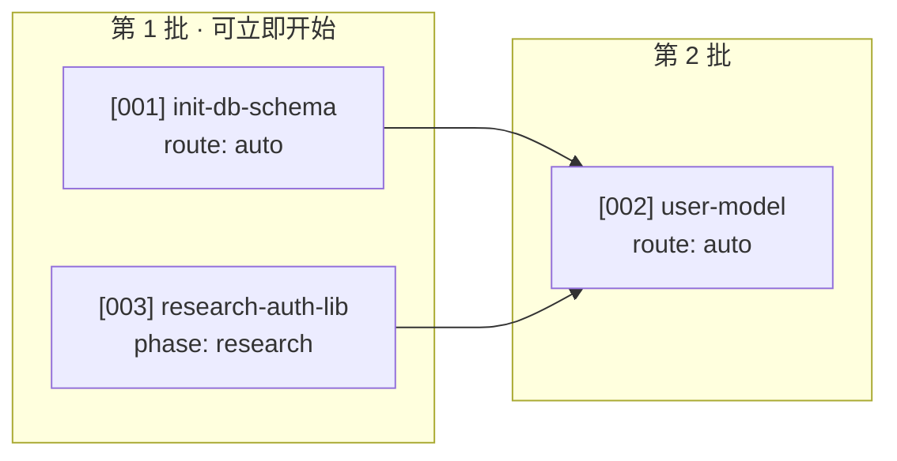

# To Tickets

把 spec 拆成可以在任意合适 runtime 中执行的 ticket。每个 ticket 是自包含的：拿到单个 ticket 的 agent 或当前会话能直接开始工作，不需要猜测执行环境或重新阅读整份 spec。

## 前提

- 已有一份 spec 在 `.workflow/specs/` 下
- `.workflow/config.json` 存在
- 如果要写显式 agent 或 runtime，`.workflow/agents.json` 和 `.workflow/runtimes.json` 已存在

## 流程

1. **读 spec**：识别实现功能需要的工作单元和外部行为。
2. **拆分**：每个 ticket 是一个 tracer bullet，端到端贯穿一个行为，不做横向切片。
3. **声明阻塞边**：列出必须先完成的 ticket；无依赖就写“无”。
4. **声明能力**：写清任务需要 `execute`、`verify`、`isolated-worktree`、`parallel` 或其它能力。多个必需能力放 `capabilities_all`，二选一放 `capabilities_any`。
5. **路由提示**：根据已知约束填写 runtime、adapter、agent。无法确定时写 `auto`，不要猜一个固定环境或 agent。
6. **写文件**：feature ticket 写入 `.workflow/tickets/`；bug fix ticket 写入 `.workflow/bugs/tickets/`。

## Canonical route block

所有新 ticket 在状态行后使用统一机器格式：

```markdown
<!-- status: todo -->
<!-- route:
 phase: execution
 runtime_id: auto
 adapter_id: auto
 agent_id: auto
 capabilities_all: [execute]
 capabilities_any: []
-->
<!-- released: <version> -->
```

字段含义：

- `phase`：通常是 `execution`；验证、review 和 integration 使用各自阶段
- `runtime_id`：在哪里运行，写稳定 ID、`auto` 或 `null`
- `adapter_id`：通过什么机制运行，写稳定 ID、`auto` 或 `null`
- `agent_id`：谁执行，写稳定 ID、`auto` 或 `null`。`null` 表示当前用户会话、脚本或人工执行
- `capabilities_all`：必须全部具备
- `capabilities_any`：非空时至少具备一个

人读的 `## 🧭 路由` 只是这段 route 的说明，不是第二套机器格式。不要再生成只有 `## 🤖 建议 Agent` 的新 ticket。旧 ticket 可以由 `/route-agent` 兼容读取。

## ticket 模板

```markdown
<!-- status: todo -->
<!-- route:
 phase: execution
 runtime_id: auto
 adapter_id: auto
 agent_id: auto
 capabilities_all: [execute, verify]
 capabilities_any: []
-->
<!-- released: <version> -->

# [<ticket-id>] <标题>

## 📌 Spec 引用
来源：`.workflow/specs/<spec-name>.md` 的 <相关章节>

## 🎯 任务
<一句话说清完成后的可观察行为，再补上现在的行为。agent 不需要读取 spec 才能理解目标。>

## ✅ 验收标准
1. <可观察条件，能对应一个命令、请求或操作>
2. ...

## 🧪 测试 seam
<只写外部行为的测试边界>

## 🚧 阻塞
- 依赖：[<其它 ticket-id>] <标题>（必须先完成）
- 或：无（可立即开始）

## 🧭 路由
- Phase：`execution`
- Runtime：`auto`
- Adapter：`auto`
- Agent：`auto`
- 必需能力：`execute`、`verify`
- 可选能力：无
- 选择理由：<只有存在真实约束时才写，例如必须使用隔离 worktree>

## 🌿 分支
<按 config 的 branch_template，如 ticket/001-user-auth>

## 🧩 上下文
<agent 需要知道的代码结构、术语和约束。能从代码里读出来的不要抄。>

<跨模块调用、状态迁移或数据流可放一张不超过九个节点的 Mermaid 图。>
```

`runtime`、`adapter` 和 `agent` 是三个独立字段：

- `runtime`：在哪里运行
- `adapter`：通过什么任务机制运行
- `agent`：谁执行

至少写出 `capabilities_all` 和 `capabilities_any`。如果没有环境或 agent 约束，写 `auto`，让 `/route-agent` 按注册表动态匹配。

## 三个字段的写法

**`## 🎯 任务`** 必须描述起点和终点。不要只写“实现用户认证模块”，要写清输入、输出、错误和当前 stub。

**`## ✅ 验收标准`** 写成可观察行为，不写“功能正常”或“代码质量良好”。每条标准都要能对应命令、请求或点击。

**`## 🧭 路由`** 只记录真实约束。想表达“可在任意环境运行”时写 `auto`，不要为了看起来具体而写一个当前机器名称。

**`## 🧩 上下文`** 只写 agent 在现场拿不到的东西。技术方案在 spec 里已经论证过，这里给落点，不重新论证。

## 路由提示规则

- 需要隔离 worktree 时：`capabilities_all` 加 `isolated-worktree`
- 需要同时推进多个 ticket 时：加 `parallel`，并确认目标 adapter 声明该能力
- 需要 CodeG To-dos 的特定功能时：写 `adapter_id: codeg-todos`，同时说明为什么没有其它 adapter 可以替代
- 只需要某类 agent 时：写稳定的 `agent_id`，不写 display name
- 允许当前会话直接完成时：写 `agent_id: null`，并确认 adapter 的 `agent_ids` 是空数组
- 不确定时：调用 `/route-agent` 预检，让它输出 runtime、adapter、agent 三个维度

## 路径

- feature ticket：`.workflow/tickets/<id>-<slug>.md`
- release ticket：`.workflow/version/tickets/v<version>.md`，由 `/version` 创建
- bug fix ticket：`.workflow/bugs/tickets/<id>-fix-<slug>.md`

## 拓扑排序输出

拆完后输出依赖关系和每个 ticket 的 route 意图。Mermaid 节点可以写 `[ticket-id]`，不要把示例 agent 名当成默认值：

````markdown

````

图里如果展示具体 runtime、adapter 或 agent，必须说明它们来自当前注册表，不是仓库默认。

同时给出可复制的分派清单：

```markdown
🟢 可立即开始
- [001] init-db-schema → runtime: auto / adapter: auto / agent: auto

🟡 等待 [001]
- [002] user-model → runtime: auto / adapter: auto / agent: auto
```

## 回报给用户

按 `/readable-docs` 回复：给出拆出几个、谁阻塞谁、哪些 route 是显式约束、哪些会动态匹配。不要复述整批 ticket。

## 下一步

- 📤 提交 `.workflow/` 到 git
- 🧭 如果 route 有疑问，运行 `/route-agent` 预检
- 🚀 在具备 `dispatch` 或 `execute` 能力的目标 runtime 上运行 `/dispatch`
