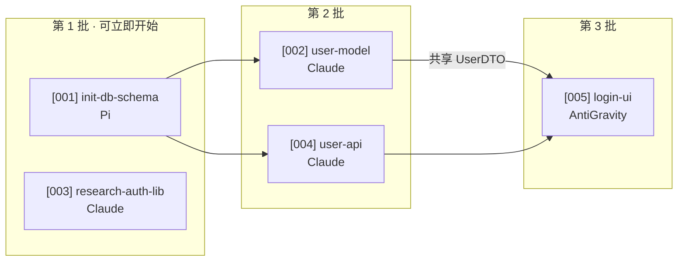

# To Tickets

把 spec 拆成一组可以在 CodeG 上并发执行的 ticket。每个 ticket 是自包含的：服务器端 agent 拿到单个 ticket 就能干活，不需要读取整个 spec。

## 前提

- 已有一份 spec 在 `.workflow/specs/` 下。
- `.workflow/config.json` 存在（读取分支模板等配置）。

## 流程

1. **读 spec**：通读 spec，识别出实现这个功能需要的工作单元。

2. **拆分原则**：
   - 每个 ticket 是一个 **tracer bullet**：端到端贯穿一个行为，不是横向切片（不是"先写所有 model，再写所有 controller"）。
   - 每个 ticket 自包含：包含足够上下文让一个新 agent session 能直接干活。
   - 每个 ticket 声明 **阻塞边**：它依赖哪些其它 ticket 先完成。
   - 互不依赖的 ticket 可以并发分派给不同 agent。

3. **agent 分派建议**：根据 `.workflow/config.json` 的 `agent_routing`，为每个 ticket 标注建议的 agent（Claude / Pi / AntiGravity）。如果配置为空，根据 ticket 内容自动判断。

4. **写 ticket 文件**：每个 ticket 一个文件，写入 `.workflow/tickets/`。

## ticket 模板

```markdown
# [<ticket-id>] <标题>

## 📌 Spec 引用
来源：`.workflow/specs/<spec-name>.md` 的 <相关章节>

## 🎯 任务
<一句话说清做完之后的行为有什么不同，再补上现在是什么样。
 agent 视角描述，自包含，不需要读 spec。>

## ✅ 验收标准
1. <可观察的条件，能写出验证它的命令或操作>
2. ...

## 🧪 测试 seam
<在这个 seam 上测试，只测外部行为>

## 🚧 阻塞
- 依赖：[<其它 ticket-id>] <标题>（必须先完成）
- 或：无（可立即开始）

## 🤖 建议 Agent
<Claude | Pi | AntiGravity>
理由：<一句话>

## 🌿 分支
<按 config 的 branch_template，如 ticket/001-user-auth>

## 🧭 上下文
<agent 需要知道的代码结构和术语。写清相关代码现在在哪、长什么样、为什么是这样，
 不要只写文件名列表，也不要贴一段 spec 原文。ADR 引用写编号和结论。>

<涉及跨模块调用、状态迁移或数据流的，在这里放一张小的 Mermaid 图。
 节点用真实模块名和端点，边上写清流过去的是什么。不要画超过九个节点。>
```

标题上的 emoji 是示意，你按这批 ticket 的内容自己选一套，同一批里保持一致。

`/readable-docs` 有完整规则。有两条执行时最容易打折扣，这里点出来：

- ✂️ **段落要短。** 一段一个意思，讲完就空行换段，三五行为宜。任务描述和上下文都按这个标准拆
- 🎨 **emoji 不要省。** 每个段落开头、每条验收标准前面都配一个做锚点

## 三个字段的写法

**`## 🎯 任务`** 是 ticket 里唯一必须被读懂的地方。不合格：

> 实现用户认证模块。
> 涉及文件：src/auth/*

合格的：

> 让 `POST /api/login` 在凭证正确时返回一个 30 分钟有效的 access token，凭证错误时返回 401 和错误码 `INVALID_CREDENTIALS`。
>
> 现在这个 handler 是个 stub，无论输入都返回 200 和空 body。`src/auth/login.test.ts` 里已经有三条失败用例描述了期望行为，先让它们变绿。

差在哪：不合格那段给了范围和名词，agent 得自己猜行为；合格那段给了起点和终点，agent 直接知道什么算做完。

**`## ✅ 验收标准`** 写成可观察的行为，不要写成「功能正常」「代码质量良好」。每条标准要能对应一个命令、一次请求或一次点击。

**`## 🧭 上下文`** 只写 agent 在现场拿不到的东西。能从代码里读出来的不要抄，抄了反而会过期。技术方案在 spec 里已经论证过，这里不重新论证，只给落点。涉及跨模块调用、状态迁移、数据流的时候，一张小图比三段话有用。

ticket 也是人读的文档。review diff 时你会靠它判断 agent 做的是不是这件事，所以任务描述要能让你在三十秒内回忆起原本要什么。

## 路径

ticket 文件存入 `.workflow/tickets/<id>-<slug>.md`，id 用三位数字序号，slug 用 kebab-case。

## 拓扑排序输出

拆完后，输出一个执行顺序图，让用户看到哪些 ticket 可以并发、哪些有依赖。

用 Mermaid 画依赖关系，按批次分组。节点上带 ticket id 和建议 agent，边上可以标注共享的文件或接口，那种地方是冲突高发区。画法见 `/readable-docs` 的「Mermaid 图」。

````markdown

````

如果拆分结果很小，两三个 ticket，图可以省掉，直接用文字说清谁先谁后。

同时给一份可复制的分派清单，让用户能直接照着在 CodeG 里建任务：

```markdown
🟢 可立即开始
- [001] init-db-schema → Pi
- [003] research-auth-lib → Claude

🟡 等待 [001]
- [002] user-model → Claude
- [004] user-api → Claude

🔴 等待 [002] [004]
- [005] login-ui → AntiGravity
```

## 回报给用户

按 `/readable-docs` 的「写完之后的回复」发一条四块回复。

ticket 类的第二块给**拆出几个、谁阻塞谁、怎么并发**，第三块给分派建议要不要调。上面的拓扑图和分派清单已经展示过了，回复里不要再重复一遍，指路就行。

## 下一步

拆分完成后，按 `/readable-docs` 的清单过一遍 ticket。这一批文件在服务器上不会再有人替你重写，任务描述写得含糊，agent 就会自己编一个理解。

然后告知用户：

- 📤 将 `.workflow/` 目录提交到 git 并推送到服务器仓库
- 🚀 在服务器 CodeG 上运行 `/dispatch` 开始并发执行